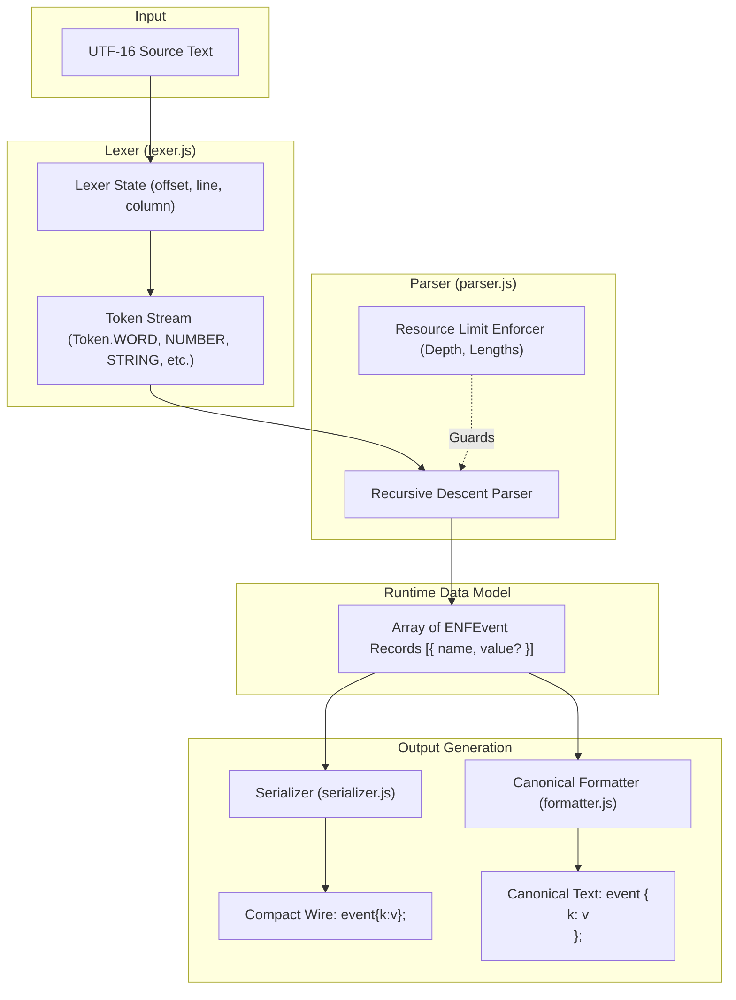
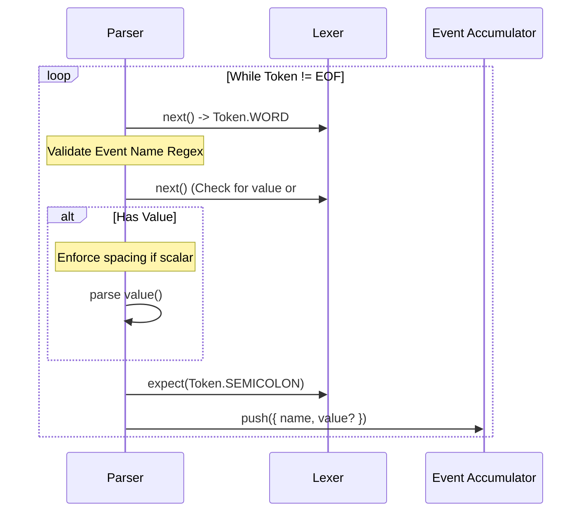
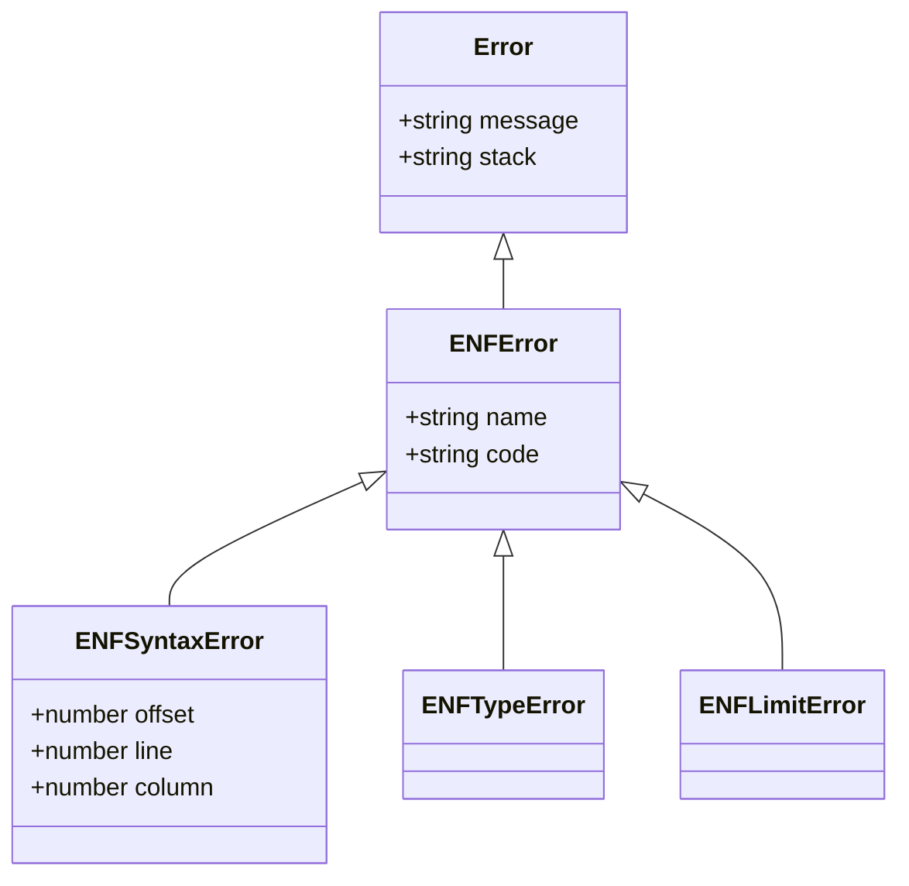

# ENF Architecture & Internal Design

This document details the internal architecture, parsing algorithms, data models, memory representations, and security boundaries of `@mhmtsnmzkanly/enf-js`.

---

## 1. High-Level Architectural Pipeline

ENF is implemented as a streaming-friendly, zero-dependency engine. Unlike conventional compilers that construct intermediate Abstract Syntax Trees (ASTs), ENF employs a **Direct-to-Model** recursive descent architecture.



### Key Design Rationale: AST-Free Execution
Building a dedicated AST requires allocating thousands of intermediate node objects (`{ type: 'Literal', value: ... }`) per document. Because ENF's target model maps directly to JavaScript primitives (`null`, `boolean`, `number`, `string`, `Array`, plain `Object`), the parser instantiates final runtime values immediately, reducing memory allocation and garbage collection overhead by orders of magnitude.

---

## 2. Lexical Analysis (`src/lexer.js`)

The `Lexer` scans the input string character-by-character using single-character lookahead (`peek()`) without backtracking.

### Token Types
| Token Type | Representation | Source Examples |
| :--- | :--- | :--- |
| `WORD` | Generic identifier | `chat.send`, `true`, `false`, `null` |
| `STRING` | Escaped double-quoted text | `"hello world"`, `"\u0041"` |
| `NUMBER` | RFC 8259 JSON Number | `17`, `-2.5`, `1.25e3`, `-0` |
| **Punctuation** | Single characters | `{`, `}`, `[`, `]`, `:`, `,`, `;` |
| `EOF` | End-of-file sentinel | End of string stream |

### Lexer Validation Rules
1. **Numbers (Strict JSON Lexical Grammar):**
   - Leading zeroes (`01`), explicit plus signs (`+1`), omitted integer parts (`.5`), and trailing decimals (`1.`) are rejected immediately (`E_INVALID_NUMBER`).
   - Finite range: `Number.isFinite(val)` must be true.
   - Safe Integer bounds: If integer-valued, `Number.isSafeInteger(val)` is strictly enforced across `[-(2^53 - 1), 2^53 - 1]`. Exponential notations yielding unsafe integers (such as `1e20`) are rejected (`E_NUMBER_RANGE`).
   - Negative zero (`-0`) is detected and preserved.

2. **Strings & Unicode Surrogates:**
   - Unescaped control characters in the range `U+0000` through `U+001F` trigger `E_INVALID_STRING`.
   - **Surrogate Pair Hygiene:** High surrogates (`0xD800`–`0xDBFF`) must be immediately followed by a low surrogate (`0xDC00`–`0xDFFF`). Lone high or lone low surrogates (both escaped and unescaped) are rejected with `E_INVALID_STRING`.
   - **Length Measurement:** String bounds are measured in **UTF-16 code units** (`String.prototype.length`) *after* escape decoding.

---

## 3. Syntactic Analysis (`src/parser.js`)

The parser is a deterministic, LL(1) **Bounded Recursive Descent Parser**.



### Parsing Rules & Invariants

#### 1. Event Names
Validated against:
```regex
^[a-z][a-z0-9_]*(?:\.[a-z][a-z0-9_]*)*$
```
- ASCII lowercase only.
- Segments are separated by dots (`.`).
- Empty segments, leading/trailing dots, hyphens, and uppercase characters are rejected (`E_INVALID_EVENT_NAME`).
- The parser **never** splits names into nested objects; `chat.message.send` remains a flat string.

#### 2. The Spacing Rule
To maintain lexical unambiguity:
- **Scalars** (`string`, `number`, `true`, `false`, `null`) MUST be separated from the event name by at least one whitespace character (`ping 1;`).
- **Containers** (`{...}`, `[...]`) MAY immediately touch the event name (`ping{id:1};`).

#### 3. Object Member Integrity & No Duplicate Keys
Unlike JSON parsers (which often silently overwrite earlier keys with later ones), ENF strictly rejects duplicate keys:
```javascript
if (Object.hasOwn(result, key)) {
  this.fail(`Duplicate object key '${key}'`, 'E_DUPLICATE_KEY', keyToken);
}
```
Object keys are constrained to `^[a-z][a-z0-9_]*$`. Quoted keys and trailing commas are rejected.

---

## 4. Resource Limits & Denial-of-Service Defense

To protect runtimes from resource exhaustion attacks (ReDoS, deeply nested container stack overflow, memory bloat), the parser enforces finite caps at runtime:

```javascript
export const DEFAULT_LIMITS = Object.freeze({
  maxSourceLength: 16 * 1024 * 1024, // 16 MiB
  maxDepth: 64,                      // Container nesting recursion limit
  maxStatements: 100_000,            // Total events per document
  maxArrayLength: 10_000,            // Maximum elements per array
  maxObjectEntries: 10_000,          // Maximum key-value pairs per object
  maxStringLength: 256 * 1024,       // 262,144 UTF-16 code units
});
```

### Nesting Guard Implementation
Container recursion is defended using an internal `depth` counter paired with a `try...finally` block:
```javascript
enterContainer() {
  this.depth++;
  if (this.depth > this.limits.maxDepth) {
    throw new ENFLimitError('Maximum nesting depth exceeded', 'E_MAX_DEPTH');
  }
}

array() {
  this.enterContainer();
  try {
    // parse elements...
  } finally {
    this.depth--;
  }
}
```

---

## 5. Serialization & Canonical Formatting (`src/serializer.js`)

The serialization subsystem translates verified JavaScript data structures into deterministic text.

### Safety Checks Performed by `stringify()`
1. **Cycle Detection:** Maintains a traversal `Set` of active parent objects (`ancestors`). Encountering an active ancestor throws `E_CYCLE`.
2. **Prototype Validation:** Every object must satisfy `Object.getPrototypeOf(obj) === Object.prototype` or `Object.getPrototypeOf(obj) === null`. Class instances, `Date`, `Map`, `Set`, and foreign prototypes are rejected.
3. **Property Hygiene:**
   - Property keys are inspected via `Reflect.ownKeys()`. Symbol properties are rejected.
   - Non-enumerable properties are rejected.
   - Property getters/setters (accessors) are rejected (`!Object.hasOwn(descriptor, 'value')`).
4. **Number Normalization:** Negative zero is serialized as `"-0"`. Unsafe integers and non-finite numbers trigger `E_UNSAFE_INTEGER` and `E_NON_FINITE_NUMBER`.

### Canonical Formatter Invariants
`format(source)` parses the source into the canonical data model and re-serializes it under deterministic rules:
- Two spaces (`"  "`) per indentation depth.
- Non-empty containers place each element/entry on a separate line.
- Empty containers collapse to `{}` and `[]`.
- Space between event name and value.
- Exact terminating semicolon and newline per event statement.

---

## 6. Error Hierarchy & Classification (`src/errors.js`)

All exceptions inherit from `ENFError`:



### Error Taxonomy
| Class | Common Error Codes | Cause |
| :--- | :--- | :--- |
| **`ENFSyntaxError`** | `E_UNEXPECTED_TOKEN`<br>`E_INVALID_EVENT_NAME`<br>`E_EXPECTED_SEMICOLON`<br>`E_INVALID_KEY`<br>`E_DUPLICATE_KEY`<br>`E_INVALID_NUMBER`<br>`E_NUMBER_RANGE`<br>`E_INVALID_STRING`<br>`E_UNEXPECTED_EOF` | Grammar violations, illegal characters, incomplete tokens. Always includes source `offset`, `line`, and `column`. |
| **`ENFLimitError`** | `E_LIMIT`<br>`E_MAX_SOURCE_LENGTH`<br>`E_MAX_DEPTH`<br>`E_MAX_STATEMENTS`<br>`E_MAX_ARRAY_LENGTH`<br>`E_MAX_OBJECT_ENTRIES`<br>`E_MAX_STRING_LENGTH` | Payload exceeded configured resource envelope. Distinct from syntax errors. |
| **`ENFTypeError`** | `E_INVALID_ARGUMENT`<br>`E_INVALID_OPTION`<br>`E_UNSUPPORTED_VALUE`<br>`E_CYCLE`<br>`E_SPARSE_ARRAY` | Invalid API parameters, unsafe numeric operations, or unsupported JS object structures passed to `stringify()`. |

---

## 7. Mathematical & Equivalence Invariants

Conforming implementations must guarantee the following algebraic invariants:

1. **Round-Trip Equivalence:**
   For any valid ENF document $d$:
   $$\text{parse}(\text{stringify}(\text{parse}(d))) \equiv \text{parse}(d)$$
2. **Formatting Stability (Idempotency):**
   Formatting an already formatted document yields an identical string:
   $$\text{format}(\text{format}(d)) = \text{format}(d)$$
3. **Deterministic Statement Isolation:**
   Given two documents $A$ and $B$, the concatenated stream $A + B$ parses identically to parsing $A$ and $B$ independently:
   $$\text{parse}(A + B) \equiv \text{parse}(A) \cup \text{parse}(B)$$
   *(Assuming total statements remain within configured resource limits).*
