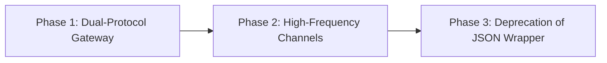

# Migrating from JSON to ENF: An Architectural Transition Guide

This guide provides a structured, phased roadmap for migrating real-time protocols, event buses, and WebSockets from **JSON** (or JSON-RPC / Socket.IO) to **ENF (Event Notation Format)** without downtime or breaking legacy clients.

---

## 1. Syntax Mapping Reference

ENF does not replace all JSON structures, but it dramatically simplifies event messaging. Use this mapping table during refactoring:

| Pattern | JSON / JSON-RPC / Socket.IO | ENF Equivalent | Wire Byte Savings |
| :--- | :--- | :--- | :--- |
| **Simple Notification** | `{"event":"ping","data":null}` | `ping;` | **-83%** (6 vs 35 bytes) |
| **Named Event with Payload** | `{"event":"chat.send","data":{"text":"hello"}}` | `chat.send {text:"hello"};` | **-41%** (27 vs 46 bytes) |
| **Scalar Event Value** | `{"event":"sensor.temp","value":24.5}` | `sensor.temp 24.5;` | **-54%** (17 vs 37 bytes) |
| **Array of IDs** | `{"event":"users.select","ids":[1,2,3]}` | `users.select [1,2,3];` | **-42%** (23 vs 40 bytes) |
| **Multiple Batched Events** | `[{"event":"e1"},{"event":"e2"}]` | `e1;e2;` | **-78%** (7 vs 32 bytes) |
| **JSON-RPC 2.0 Notification**| `{"jsonrpc":"2.0","method":"sync","params":{"v":1}}` | `sync {v:1};` | **-78%** (11 vs 51 bytes) |

---

## 2. The Phased Migration Strategy

Migrating in production should follow a zero-downtime, 3-phase rollout:



1. **Phase 1 (Dual-Protocol Gateway):** Upgrade the server to accept both JSON and ENF transparently on the same WebSocket endpoint.
2. **Phase 2 (Selective Client Migration):** Migrate high-frequency, performance-sensitive clients (desktop apps, web clients, telemetry daemons) to send and receive ENF.
3. **Phase 3 (Legacy Deprecation):** Deprecate JSON payload framing once all active clients are updated.

---

## 3. The Dual-Protocol Gateway Pattern

You can support both JSON and ENF on the exact same WebSocket connection with zero handshake overhead. By inspecting the leading non-whitespace character, the gateway instantly routes to the appropriate parser:

```javascript
import { WebSocketServer } from 'ws';
import { tryParse, stringify } from '@mhmtsnmzkanly/enf-js';

const wss = new WebSocketServer({ port: 8080 });

wss.on('connection', (socket) => {
  // Protocol negotiation flag (default: legacy JSON)
  socket.protocolFormat = 'json';

  socket.on('message', (raw) => {
    const text = raw.toString('utf8').trimStart();
    if (!text) return;

    const firstChar = text[0];

    // Automatic format detection:
    // JSON documents always begin with '{' or '['
    if (firstChar === '{' || firstChar === '[') {
      handleLegacyJSON(socket, text);
    } else {
      // ENF statements always begin with a lowercase ASCII identifier: ^[a-z]
      handleENF(socket, text);
    }
  });
});

function handleLegacyJSON(socket, raw) {
  try {
    const payload = JSON.parse(raw);
    const event = {
      name: payload.event || payload.type || payload.method,
      value: payload.data ?? payload.params
    };
    dispatch(socket, event);
  } catch (err) {
    socket.send(JSON.stringify({ error: 'INVALID_JSON' }));
  }
}

function handleENF(socket, raw) {
  // Client upgraded to ENF
  socket.protocolFormat = 'enf';

  const result = tryParse(raw);
  if (!result.ok) {
    socket.send(`system.error {code: "${result.error.code}"};`);
    return;
  }

  for (const event of result.value) {
    dispatch(socket, event);
  }
}

// Transparent outbound sender respecting client format
export function sendEvent(socket, event) {
  if (socket.protocolFormat === 'enf') {
    socket.send(stringify([event]));
  } else {
    socket.send(JSON.stringify({ event: event.name, data: event.value }));
  }
}

function dispatch(socket, event) {
  console.log(`[Dispatch: ${socket.protocolFormat}]`, event.name, event.value);
  
  if (event.name === 'client.hello') {
    sendEvent(socket, { name: 'session.ready', value: { status: 'ok' } });
  }
}
```

---

## 4. Client Refactoring Walkthrough

### Before: Legacy JSON WebSocket Client
```javascript
// Legacy Client
const ws = new WebSocket('ws://localhost:8080');

function send(event, data) {
  ws.send(JSON.stringify({ event, data }));
}

ws.onmessage = (msg) => {
  const { event, data } = JSON.parse(msg.data);
  if (event === 'chat.message') renderChat(data);
};

// Emitting
send('chat.message', { text: 'Hello' });
send('presence.ping', null);
```

### After: ENF WebSocket Client
```javascript
// Modern ENF Client
import { tryParse, stringify } from '@mhmtsnmzkanly/enf-js';

const ws = new WebSocket('ws://localhost:8080');

function send(events) {
  ws.send(stringify(events));
}

ws.onmessage = (msg) => {
  const result = tryParse(msg.data);
  if (!result.ok) return;

  for (const event of result.value) {
    if (event.name === 'chat.message') renderChat(event.value);
  }
};

// Emitting with batching and valueless ping
send([
  { name: 'chat.message', value: { text: 'Hello' } },
  { name: 'presence.ping' } // No "data: null"
]);
```

---

## 5. Migration Gotchas & Pitfalls

1. **Object Keys Must Be Lowercase Identifiers:**
   - JSON: `{"UserID": 1, "created-at": 100}`
   - ENF: Keys must match `^[a-z][a-z0-9_]*$`. You must rename keys to `user_id` and `created_at`.
2. **Duplicate Keys Are Hard Errors:**
   - JSON allows `{"a": 1, "a": 2}` (last write wins).
   - ENF rejects this immediately (`E_DUPLICATE_KEY`). Ensure your serializers do not emit repeated keys.
3. **No Bare Numbers as Statements:**
   - In JSON, `42` is a valid top-level JSON document.
   - In ENF, all values must belong to an event statement: `data.value 42;`.
