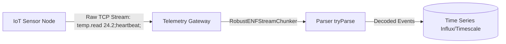

# Recipe 2: High-Frequency IoT Telemetry & Sensor Ingestion

This recipe implements a memory-bounded, zero-overhead **TCP telemetry daemon and ingestion server** for resource-constrained edge devices (ESP32, Raspberry Pi, industrial PLCs, smart meters) using **ENF (Event Notation Format)**.

---

## 1. Architectural Overview

IoT sensors and industrial fieldbuses typically send discrete readings over raw TCP sockets, Serial ports, or lightweight cellular channels (NB-IoT / LTE-M).



### Why ENF Beats JSON & Protobuf in Edge Telemetry
1. **No Delimiter Headaches:** JSON requires newline hacks (`NDJSON`) or prepended length prefixes. ENF statements naturally delimit via `;`.
2. **Scalar Wire Savings:** A numeric sensor update in JSON requires an object wrapper: `{"temp": 24.2}` (16 bytes). In ENF: `temp.read 24.2;` (16 bytes including event name, or `t 24.2;` for 8 bytes total).
3. **No Dynamic Codec Compilation:** Unlike Protobuf or FlatBuffers, ENF does not require heavy runtime decoders or compiled schemas on memory-constrained edge runtimes.
4. **Human Inspectability:** Raw packets can be inspected directly using standard tools like `tcpdump`, `nc`, or `minicom`.

---

## 2. Production Implementation

### Ingestion Server: `TelemetryGateway.js` (Node.js Raw TCP)

```javascript
import { createServer } from 'node:net';
import { tryParse, DEFAULT_LIMITS } from '@mhmtsnmzkanly/enf-js';

const SENSOR_LIMITS = Object.freeze({
  ...DEFAULT_LIMITS,
  maxSourceLength: 4 * 1024,  // 4 KB max burst per stream window
  maxStatements: 32,          // Up to 32 readings per burst
  maxDepth: 2,                // Shallow: only scalars or simple key-values
  maxStringLength: 128,
});

class RobustENFStreamChunker {
  constructor(onEvents, limits, maxBufferBytes = 16 * 1024) {
    this.buffer = '';
    this.onEvents = onEvents;
    this.limits = limits;
    this.maxBufferBytes = maxBufferBytes;
  }

  feed(chunkText) {
    this.buffer += chunkText;

    if (this.buffer.length > this.maxBufferBytes) {
      this.buffer = '';
      throw new Error('TCP Stream Buffer Overflow: client sending un-delimited data.');
    }

    let searchOffset = 0;

    // Scan for semicolon delimiters
    while (searchOffset < this.buffer.length) {
      const semicolonIndex = this.buffer.indexOf(';', searchOffset);
      if (semicolonIndex === -1) {
        // Trailing partial data awaits the next TCP packet
        break;
      }

      const candidate = this.buffer.slice(0, semicolonIndex + 1);
      const result = tryParse(candidate, this.limits);

      if (result.ok) {
        // Semicolon safely resolved completed statements
        this.buffer = this.buffer.slice(semicolonIndex + 1);
        searchOffset = 0;
        this.onEvents(result.value);
      } else if (result.error.code === 'E_UNEXPECTED_EOF') {
        // Semicolon was inside a quoted string; scan for subsequent semicolon
        searchOffset = semicolonIndex + 1;
      } else {
        // Genuine protocol violation
        this.buffer = '';
        throw result.error;
      }
    }
  }
}

const server = createServer((socket) => {
  const remote = `${socket.remoteAddress}:${socket.remotePort}`;
  console.log(`[TCP Ingress] Sensor connected from ${remote}`);

  let deviceId = null;

  const chunker = new RobustENFStreamChunker(
    (events) => {
      for (const event of events) {
        handleSensorEvent(socket, event, remote);
      }
    },
    SENSOR_LIMITS
  );

  socket.on('data', (data) => {
    try {
      chunker.feed(data.toString('utf8'));
    } catch (err) {
      console.warn(`[TCP Violation] Terminating ${remote}: ${err.message}`);
      socket.write(`error.rejected {code: "${err.code || 'E_INVALID'}"};\n`);
      socket.destroy();
    }
  });

  socket.on('error', (err) => console.error(`[TCP Socket Error] ${remote}:`, err.message));
  socket.on('close', () => console.log(`[TCP Ingress] Sensor disconnected: ${remote}`));
});

function handleSensorEvent(socket, event, remote) {
  switch (event.name) {
    case 'device.handshake':
      // e.g. device.handshake {id: "sens_01", fw: "1.2.0"};
      socket.deviceId = event.value.id;
      console.log(`[Auth] Registered sensor: ${socket.deviceId} (${remote})`);
      socket.write('device.ack;\n'); // valueless acknowledgement
      break;

    case 'telemetry.metric':
      // e.g. telemetry.metric {temp: 23.4, humidity: 48.1, pressure: 1013.2};
      recordTimeSeries(socket.deviceId || remote, event.value);
      break;

    case 'metric.temperature':
      // Direct scalar form: metric.temperature 24.15;
      console.log(`[Scalar Metric] ${socket.deviceId}: temp = ${event.value}°C`);
      break;

    case 'device.heartbeat':
      // Valueless event: device.heartbeat; (only 17 bytes on the wire)
      updateLiveness(socket.deviceId || remote);
      break;

    default:
      console.warn(`[Warning] Unknown telemetry event: ${event.name}`);
  }
}

function recordTimeSeries(devId, data) {
  // Production integration: write to InfluxDB / TimescaleDB / QuestDB
  // console.log(`[TSDB Write] ${devId} ->`, data);
}

function updateLiveness(devId) {
  // console.log(`[Heartbeat] ${devId} is alive`);
}

server.listen(9000, () => {
  console.log('ENF IoT Telemetry TCP Server listening on port 9000');
});
```

---

### Edge Client: `SensorNode.js` (Simulated ESP32 / Gateway Client)

```javascript
import { createConnection } from 'node:net';
import { stringify } from '@mhmtsnmzkanly/enf-js';

const client = createConnection({ port: 9000, host: 'localhost' }, () => {
  console.log('Connected to Telemetry Gateway');

  // 1. Initial Handshake
  client.write(stringify([
    { name: 'device.handshake', value: { id: 'sensor_rig_42', fw: '2.1.0' } }
  ]) + '\n');

  // 2. High-Frequency Metric Emission Loop
  let counter = 0;
  setInterval(() => {
    counter++;

    if (counter % 5 === 0) {
      // Periodic Valueless Heartbeat (Extremely cheap over cellular)
      client.write('device.heartbeat;\n');
    } else {
      // Pack multiple sensor readings in one TCP burst
      const burst = stringify([
        { name: 'metric.temperature', value: Number((20 + Math.random() * 5).toFixed(2)) },
        { name: 'telemetry.metric', value: { volt: 3.28, lux: Math.floor(Math.random() * 800) } }
      ]);
      client.write(burst + '\n');
    }
  }, 1000);
});

client.on('data', (data) => {
  console.log('Received gateway reply:', data.toString().trim());
});
```

---

## 3. Cellular Data Savings Benchmark (100,000 Heartbeats + Metrics)

Scenario: Remote sensor reporting 1 temperature reading and 1 periodic heartbeat every 5 seconds for 30 days.

| Protocol | Format Example | Monthly Wire Bytes | Monthly Cellular Cost Factor |
| :--- | :--- | :--- | :--- |
| **Standard JSON (REST)** | `{"event":"temp","value":22.5}` + `{"event":"heartbeat"}` | ~48.2 MB | Baseline |
| **NDJSON over TCP** | `{"t":22.5}\n{"hb":1}\n` | ~16.8 MB | -65% |
| **ENF over TCP (Scalars + Valueless)** | `t 22.5;hb;` | **~6.4 MB** | **-86.7% data savings** |
